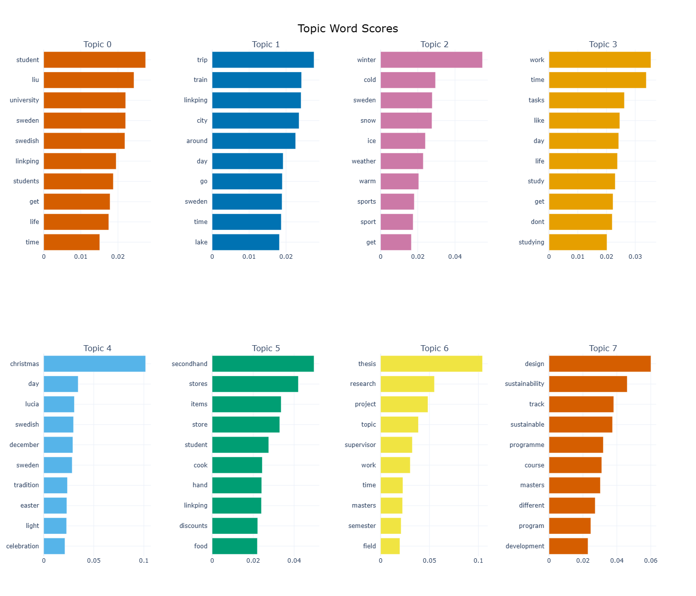

## What's this project about?
In a nutshell, this project provides an end-to-end data pipeline that scrapes blog posts from [Linköping University (LiU) student blog](https://internationalstudents.blog.liu.se/), performs unsupervised topic modeling using BERTopic to discover core themes, and automatically categorizes the live posts using the WordPress REST API.

🔑 Note: Admin access to the target WordPress site is required to run the full pipeline. However, if you are simply looking to automate post classification on your own WordPress site, you can directly utilize the standalone modules inside the tagger/ directory! ✨

### Project architecture
[ 1. Web Scraper ] ──> ( Raw Data / CSV ) ──> [ 2. Topic Modeling ] ──> ( Classified CSV ) ──> [ 3. WordPress REST API Tagger ]

1. Crawler: Extracts historical text and metadata from website.

2. Topic Modeling (BERTopic): Evaluates the text using advanced NLP techniques to cluster posts into underlying themes.
 
3. WordPress API Tagger: Maps the model's outputs to specific WordPress category IDs and updates the live site via automated API requests.

### Directory structure
├── data/
│   ├── blog_posts.csv         # Scraped raw data from the website
│   ├── tagged_posts.csv       # Categorized posts outputted by BERTopic
│   ├── cmp_tagged_posts.csv   # Final consolidated output with mapped WordPress category IDs
│   └── tb_tagged.xlsx         # Unlabeled posts flagged for manual tagging/review
├── crawler/
│   └── crawler.py             # Core scraper and data extraction functions
├── tagger/
│   ├── main.py                # Main automation execution script for WordPress REST API
│   └── tag_functions.py       # Helper functions for API authentication and tagging
├── crawler_main.py            # Execution script to run the web scraper pipeline
├── requirements.txt           # Python dependencies
└── README.md

## How to run the tag automator 
At the root directory, run:
    `python -m tagger.main`

## Results of topic modeling
The model extracts a total of 7 topics from all the 611 posts. The 10 most common terms for each topic is shown below. 
